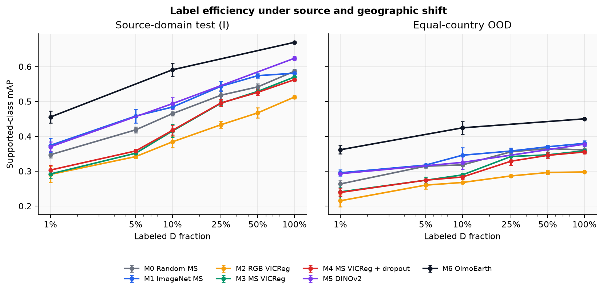
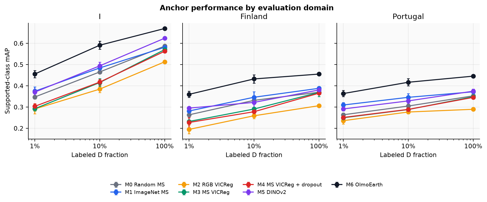
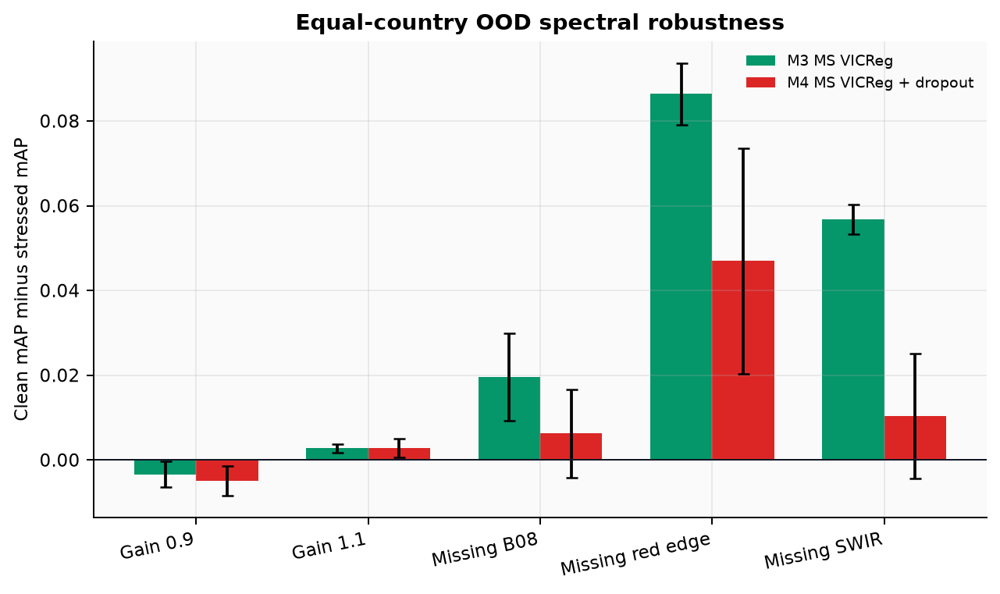
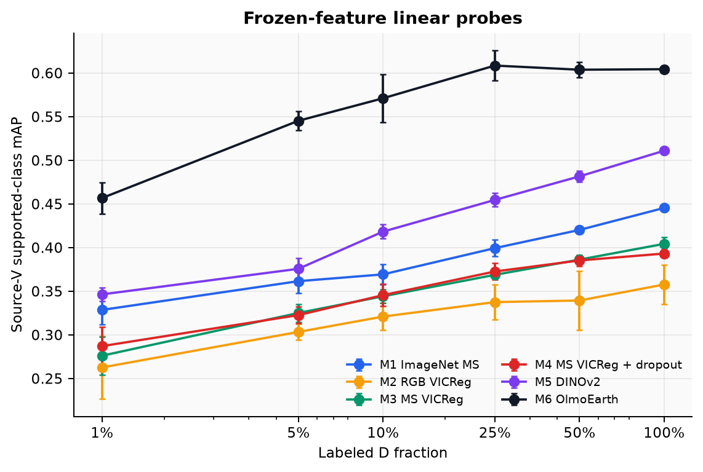
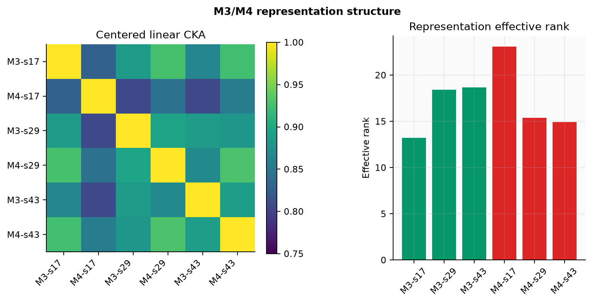

# SpectraShift: Self-Supervised Multispectral Representation Learning under Geographic and Spectral Shift

**Madhav Kapoor · September 2026**

## Abstract

SpectraShift asks two practical questions about Earth-observation representation learning. First, does self-supervised pretraining on all useful Sentinel-2 bands improve label efficiency and geographic transfer compared with RGB self-supervision? Second, does deliberately withholding coherent spectral groups during pretraining create robustness to missing bands without destroying information needed for clean land-cover recognition?

I built a controlled BigEarthNet v2 study around 20,000 unlabeled source patches, a 12,000-patch labeled reservoir, six nested label budgets, a fixed source validation set, a source-domain test set, and held-out Finland and Portugal test sets. The controlled models use the same ResNet-18 architecture and differ only in initialization, input bands, or spectral-dropout intervention. DINOv2 and OlmoEarth provide external context. Three seed bundles pair initialization, subset realization, and training randomness. All checkpoints and source-validation thresholds were frozen before final-label access.

The results reject a simple “self-supervision always helps” story. Ten-band VICReg consistently outperformed RGB VICReg, confirming the value of multispectral information, but it did not outperform random or ImageNet-initialized multispectral ResNet-18 controls after full fine-tuning. OlmoEarth was strongest at every matched anchor fraction and in every final domain. Spectral-group dropout did not improve clean transfer: at 10% labels its mean equal-country OOD difference from ordinary multispectral VICReg was `−0.0060` mAP. It did, however, improve OOD performance when B08, the red-edge group, or SWIR were removed by `+0.0073`, `+0.0334`, and `+0.0404` mAP. The study therefore identifies an invariance-information trade-off rather than a new universally superior model.

## 1. Research question and hypotheses

Sentinel-2 records visible light together with near-infrared, red-edge, and short-wave infrared measurements. These bands are useful for vegetation, moisture, and material discrimination, but they also create deployment sensitivity: sensors, products, or downstream pipelines may omit or corrupt a band group. A representation that encodes every spectral detail may perform well on clean data yet degrade sharply when a group disappears. A representation trained to survive coherent spectral removal may be more robust, but the same invariance could erase information needed for land-cover labels.

The project evaluates five linked hypotheses:

- **H1 — SSL against a matched random baseline:** ten-band VICReg M3 should improve label efficiency over random ten-band ResNet-18 M0.
- **H2 — multispectral against RGB SSL:** M3 should outperform RGB VICReg M2 when architecture, unlabeled data, optimization, and seed are matched.
- **H3 — spectral-dropout trade-off:** M4 should be compared with M3 on clean transfer and under explicit spectral failures, without selecting whichever condition looks favorable.
- **H4 — geographic transfer:** model ordering and absolute performance should be measured separately on source I, Finland, and Portugal.
- **H5 — representation mechanism:** frozen probes, CKA, effective rank, stress features, and nearest neighbours should help explain performance without becoming new model-selection signals.

The contribution is the controlled evidence and its reproducible protocol. VICReg and spectral dropout are not presented as new algorithms. A negative result against a matched random baseline is scientifically useful because it prevents an apparent gain over RGB from being misattributed to self-supervision alone.

## 2. Data and frozen geographic protocol

The source is the Sentinel-2 L2A component of BigEarthNet v2 [1, 2]. Every selected patch retains the 12 available L2A bands in the order `B02,B03,B04,B08,B05,B06,B07,B8A,B11,B12,B01,B09`. Core models use the first ten bands; OlmoEarth uses all twelve. Bands are aligned to the B02 grid at `120 × 120` pixels with transform-aware bilinear resampling, while validity masks use nearest-neighbour resampling. Radiometry is converted using verified release metadata, and normalization is fitted only on valid pixels from the unlabeled U partition.

The final split contains 45,000 patches:

| Partition | Count | Role |
| --- | ---: | --- |
| U | 20,000 | Source-only unlabeled SSL pool |
| D | 12,000 | Labeled downstream reservoir |
| V | 2,000 | Source validation and checkpoint selection |
| I | 3,000 | Frozen source-domain test |
| Finland | 4,000 | Frozen geographic test |
| Portugal | 4,000 | Frozen geographic test |

Repeated acquisitions at the same MGRS tile/row/column share a location key and cannot cross partitions. Tiles touching Finland or Portugal are excluded from U, D, V, and I. Raster footprints are projected to EPSG:3035, and training/validation pools are separated from evaluation regions using a frozen 2.4 km buffer. Evaluation uncertainty uses MGRS groups as the primary unit and fixed 12 km blocks as a sensitivity analysis.

The six downstream subsets contain 120, 600, 1,200, 3,000, 6,000, and 12,000 patches. They are exact nested prefixes of one deterministic multi-label and tile-balanced ordering per seed. The same patch IDs are reused for every model. This is a benchmark subsampling protocol, not active learning. Source-supported aggregate mAP uses 16 classes meeting the predeclared full-D support rule; all 19 classes remain in per-class tables.

Final labels were mechanically joined only after the Week 7 checkpoint ledger had frozen 111 checkpoints. The evaluation stage rejected missing, duplicate, extra, or partition-mismatched labels. No optimizer step, threshold fitting, checkpoint choice, or model ranking changed after final-label access.

## 3. Models and training controls

The controlled family uses torchvision ResNet-18:

| ID | Input and initialization |
| --- | --- |
| M0 | Ten bands, random initialization |
| M1 | Ten bands, ImageNet initialization with declared stem conversion |
| M2 | RGB B04/B03/B02, matching-seed VICReg encoder |
| M3 | Ten bands, matching-seed VICReg encoder |
| M4 | Ten bands, VICReg with 0.25 asymmetric spectral-group dropout |
| M1RGB | Three-channel ImageNet control with frozen U-derived percentile preprocessing |
| M5 | Official DINOv2 ViT-S/14 fallback, explicitly not DINOv3 |
| M6 | OlmoEarth v1.1 Tiny with its official 12-band adapter and normalizer |

M2–M4 were pretrained from random initialization on the same 20,000 U patches for 60 epochs. The VICReg implementation uses a `512 → 1024 → 1024 → 256` projector and explicitly monitors invariance, variance, covariance, projector standard deviation, and effective rank [3]. M4 alone replaces one coherent spectral group in one view with the frozen U-derived source mean with probability 0.25.

All fine-tuning runs receive a fresh 19-output head, optimizer, scheduler, and RNG state. No smaller fraction is warm-started from a larger fraction. M0–M4 use the complete six-point curves across seeds 17, 29, and 43. M5 and M6 use the 1%, 10%, and 100% anchors across the same seeds. Source V determines the earliest best checkpoint and one global threshold; I, Finland, and Portugal never influence training or selection.

DINOv2 consumes source-fitted RGB reflectance mapped through fixed U-only percentiles, resized to 126 pixels, and represented by the mean of 81 normalized patch tokens [4]. OlmoEarth receives its official twelve-band order, real acquisition month, validity mask, raw input convention, 10 m resolution, and validity-aware spatial pooling [5]. Their external pretraining is an uncontrolled advantage and potential contamination source, so they are contextual baselines rather than clean tests of source-only pretraining.

## 4. Evaluation and uncertainty

The primary metric is supported-class macro average precision. The release also records all-class and per-class AP, macro/micro F1 at 0.5 and at each run’s frozen V threshold, recall, binary Brier score, and 15-bin classwise expected calibration error. AP is reported as NA when a class lacks positives or negatives in a slice.

Equal-country OOD mAP is `(Finland mAP + Portugal mAP) / 2`; the countries are not pooled by sample count. Label-efficiency curves are summarized with normalized trapezoidal area under the curve over `log10(label count)`, while all individual fractions remain visible.

Uncertainty is descriptive. Three seeds are too few for a credible significance test. The report gives mean and sample standard deviation across seeds. For paired H1–H3 and stress comparisons, 1,000 geographic bootstrap replicates use seed 1729. MGRS groups are primary, 12 km blocks are the sensitivity analysis, and Finland and Portugal are resampled independently before equal weighting. No p-values are calculated.

## 5. Main results

### 5.1 Multispectral SSL helps relative to RGB SSL, not relative to random multispectral training

Across the complete controlled curves, M3 exceeded M2. On final equal-country OOD, the paired AULC difference was `+0.0337 ± 0.0062` mAP; on source I it was `+0.0325 ± 0.0092`. At 10% labels, mean OOD mAP was `0.2897` for M3 and `0.2680` for M2, a `+0.0217` difference. H2 is therefore supported: the additional Sentinel-2 bands provide useful information when the self-supervised setup is otherwise matched.

H1 is not supported. M3’s AULC was below M0 by `−0.0423 ± 0.0072` on I and `−0.0243 ± 0.0095` on equal-country OOD. At 10% labels, the OOD difference was `−0.0287`. M1 was also stronger than M3 in frozen linear probes: probe AULC M3−M1 was `−0.0362 ± 0.0054`. These controls show why comparing only M3 with RGB M2 would give an incomplete conclusion. Multispectral self-supervision learned more transferable features than RGB self-supervision, but the chosen small-data VICReg recipe did not create a better initialization than the random or ImageNet multispectral controls.

### 5.2 Foundation models dominate the anchors

OlmoEarth ranked first at 1%, 10%, and 100% labels in I, Finland, Portugal, and equal-country OOD. Its mean OOD mAP was `0.3619`, `0.4247`, and `0.4505` at those fractions. At 10%, the next strongest controlled model was M1 at `0.3461`; M3 achieved `0.2897`. DINOv2 was competitive but more sensitive to geographic shift than OlmoEarth.

This result should not be read as a controlled architectural comparison. OlmoEarth brings large-scale Earth-observation pretraining, a native multispectral adapter, and acquisition-date context. Its training exposure is not auditable under this project’s source-only split. The valid conclusion is that a compact released EO foundation model is a strong practical baseline and that a from-scratch 20,000-patch VICReg run does not match it.

### 5.3 Geographic shift is substantial

All models declined from source I to Finland and Portugal. For M3 at 10%, mAP fell from `0.4156` on I to `0.2908` in Finland and `0.2885` in Portugal. OlmoEarth fell from `0.5912` to `0.4325` and `0.4169`. The absolute ordering was relatively stable at the anchors, but the gap between source and target performance shows that source validation alone would overstate deployment performance.

Finland and Portugal also differ from each other by model and fraction, so the equal-country average is reported alongside both countries rather than replacing them. This study establishes transfer to two held-out European regions, not global or cross-sensor generalization.

## 6. Spectral invariance and representation evidence

### 6.1 Clean accuracy and missing-band robustness move differently

Across the full clean curves, M4 and M3 were effectively tied on I, while M4 was slightly lower on OOD. The clean OOD AULC difference was `−0.0041 ± 0.0071`; at 10% labels it was `−0.0060`. Spectral dropout therefore did not provide the hoped-for clean geographic-transfer gain.

The intervention did change failure behaviour. Under the predeclared 10% stress test, M4−M3 equal-country OOD differences were:

| Condition | M4−M3 mAP | Primary MGRS bootstrap interval |
| --- | ---: | ---: |
| Clean | −0.0060 | [−0.0157, 0.0022] |
| Missing B08 | +0.0073 | [−0.0004, 0.0138] |
| Missing red edge | +0.0334 | [0.0208, 0.0478] |
| Missing SWIR | +0.0404 | [0.0231, 0.0548] |
| Reflectance gain 0.9 | −0.0045 | [−0.0141, 0.0042] |
| Reflectance gain 1.1 | −0.0061 | [−0.0145, 0.0009] |

M3 lost `0.0864` OOD mAP under red-edge removal and `0.0568` under SWIR removal. M4 lost `0.0470` and `0.0104`. Its feature cosine change was also about half as large under those failures. This is the clearest evidence for the intended trade-off: group dropout learned tolerance to missing spectral information, but that tolerance did not improve normal clean-data transfer.

### 6.2 Frozen probes support the same ordering

The complete frozen-feature matrix contains 108 linear probes and 18 k-NN probes. OlmoEarth was strongest throughout. DINOv2 and ImageNet M1 also exceeded the student-trained VICReg encoders. M3’s linear-probe AULC exceeded M2 by `+0.0279 ± 0.0263`, while M4−M3 was only `+0.0012 ± 0.0154`. At 10% labels, k-NN M4−M3 was `−0.0053 ± 0.0150`.

These probes show that the fine-tuning result is not simply caused by a weak head or one optimization schedule. M3 represents more source-label information than RGB M2, but neither M3 nor M4 has the frozen linear separability of M1, DINOv2, or OlmoEarth.

### 6.3 CKA, effective rank, and neighbours

Matching-seed M3/M4 centered linear CKA values were `0.8276`, `0.8946`, and `0.8896`. The encoders are related but not identical. Effective rank was seed-dependent: M4 had a much higher rank than M3 for seed 17 (`23.08` versus `13.20`) but lower ranks for seeds 29 and 43. This variability argues against a simple mechanism such as “dropout always increases dimensionality.”

The fixed nearest-neighbour analysis retrieved five source-D patches for 100 hash-selected I/Finland/Portugal queries per checkpoint. M3 and M4 had almost identical mean label-set Jaccard (`0.3581` and `0.3589`) and geographic distances. The retrieval sheet and aggregate are qualitative support; they do not establish causal representation quality.

## 7. Engineering and reproducibility

The project includes streaming archive staging, transform-aware resampling, validity masks, immutable YAML contracts, deterministic nested sampling, atomic checkpoint recovery, exact successful-step accounting, configuration and source hashing, evaluation-label isolation, grouped bootstrap code, and output-free Kaggle notebooks. The public run ledger contains 363 successful training, evaluation, probe, and diagnostic records. A separate incident ledger documents seven recovered engineering failures and their fixing commits rather than hiding them.

Compact aggregates record `5.97` GPU-hours for Week 4 SSL, `3.43` for Week 5 anchors and features, `2.52` for the Week 6 additions, and `1.54` for Week 7 foundation work. Week 8 and Week 9 elapsed time was not retained in their compact aggregate, so the public compute table leaves those values missing rather than inventing a total. The private Kaggle summaries retain per-job runtime and hardware details.

The final repository excludes imagery, sealed labels, prediction logits, patch features, model weights, and patch-level neighbour/sensitivity records. Public tables and figures are bound to their private sources by SHA-256 hashes. A clean Python 3.12 environment can run all invariant tests, regenerate release figures from tracked aggregate tables, and verify that no forbidden artifact is tracked. See [REPRODUCIBILITY.md](REPRODUCIBILITY.md).

## 8. Limitations

The most important limitation is scale. Twenty thousand source-only SSL patches are small compared with modern foundation pretraining. A negative comparison with OlmoEarth is expected and does not imply VICReg is unsuitable at larger scale. The study tests one compact architecture, one redundancy-reduction objective, one spectral-dropout probability, and one pair of held-out countries.

The three seeds combine initialization, subset realization, and optimization noise; they do not independently estimate each source. Bootstrap intervals describe geographic sampling variability for this frozen benchmark and are not population-level confidence intervals. Map-derived BigEarthNet labels contain mixed-patch and temporal noise. Per-class results become unstable for rare labels and are reported as NA where support is insufficient.

The foundation baselines may have seen related geography during external pretraining. Their results are geographically held out from this project’s adaptation, not necessarily unseen during foundation pretraining. DINOv2 also uses RGB and a different architecture, while OlmoEarth adds acquisition-time context. They provide practical context, not isolated causal controls.

Spectral stress tests replace missing bands with frozen source means. This is reproducible and isolates the trained model’s response, but real sensor failures can involve structured noise, calibration drift, clouds, or resolution changes. The strong M4 robustness result should therefore motivate an independent sensor or dataset test rather than a claim of universal missing-band robustness.

### 8.1 Negative results and future work

Several outcomes narrowed the original claim. The selected VICReg recipe passed its optimization and representation-health gates, yet M3 still trailed M0 and M1. Increasing confidence in the implementation therefore does not rescue the scientific hypothesis; it strengthens the conclusion that this particular pretraining scale and recipe were insufficient. M4’s clean-transfer result is similarly negative. Its small OOD reduction was observed after the intervention and comparison had already been frozen, so the missing-band gains cannot be used to redefine the main endpoint. Effective rank also failed to give a seed-stable explanation, and nearest-neighbour summaries showed almost no aggregate separation between M3 and M4. These results are retained because they constrain plausible mechanism stories.

The most useful next experiment would change scale while keeping the controls intact. A larger, geographically broader unlabeled pool could test whether M3’s advantage over M2 eventually becomes an advantage over M0 and M1. The experiment should retain identical downstream subsets, matching-seed comparisons, and a random multispectral baseline. It should also report learning curves against both examples seen and compute consumed, because a larger SSL run may improve accuracy while remaining inefficient relative to a released foundation encoder.

A second extension should evaluate robustness on naturally incomplete or cross-sensor observations. The present source-mean replacement is an explicit intervention; it does not reproduce every physical failure. Sentinel-2 acquisitions with known detector artefacts, Harmonized Landsat Sentinel products, or a dataset with systematically absent bands would test whether the M4 advantage persists outside the synthetic stress contract. A useful design would separate channel absence, band-dependent noise, resolution mismatch, and radiometric gain so that robustness to one corruption is not generalized to all spectral shift.

Finally, the spectral intervention itself deserves a small, predeclared ablation rather than an open-ended search. Coherent-group dropout could be compared with independent band dropout and wavelength-aware masking at a few fixed probabilities. The clean-versus-stress frontier should be reported for every setting, including unsuccessful ones. Any follow-up should use a new validation protocol or an independent benchmark: the Week 8 domains have now been inspected and cannot serve as untouched model-selection data again.

## 9. Conclusion

SpectraShift demonstrates why controlled baselines matter in self-supervised Earth observation. The ten-band VICReg encoder clearly outperformed a matched RGB VICReg encoder, but random and ImageNet multispectral controls remained stronger after fine-tuning. OlmoEarth set the best practical baseline. Spectral-group dropout did not improve clean transfer, yet it materially reduced failure under missing red-edge and SWIR measurements.

The honest conclusion is a trade-off: encouraging spectral invariance can improve resilience to absent channels while slightly reducing clean predictive performance. That result is narrower than a new-model claim, but it is more useful. It identifies when the intervention helps, when it does not, and which stronger baselines a future extension must beat.

## References

1. TU Berlin RSiM/DIMA. [BigEarthNet v2 release](https://zenodo.org/records/10891137), 2024.
2. Clasen et al. [reBEN: Refined BigEarthNet Dataset for Remote Sensing Image Analysis](https://arxiv.org/abs/2502.12327), 2025.
3. Bardes, Ponce, and LeCun. [VICReg: Variance-Invariance-Covariance Regularization for Self-Supervised Learning](https://arxiv.org/abs/2105.04906), ICLR 2022.
4. Oquab et al. [DINOv2: Learning Robust Visual Features without Supervision](https://arxiv.org/abs/2304.07193), 2023.
5. Allen Institute for AI. [OlmoEarth v1.1 Tiny model card](https://huggingface.co/allenai/OlmoEarth-v1_1-Tiny), 2026.
6. ESA. [Sentinel-2 mission and instruments](https://sentinels.copernicus.eu/web/sentinel/missions/sentinel-2).
7. Full protocol, source revisions, and additional references: [project plan](docs/spectrashift-project-plan.pdf) and [provenance ledger](docs/provenance.md).
